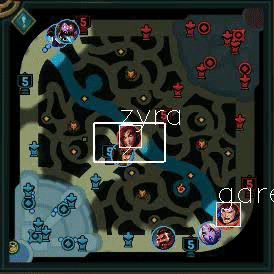

# League Map Scanner (V 1.0.0)

As of Version 7/4/2019, the program supports 31 champions(increasing).

**Required dependencies:**
Opencv, Tensorflow, Numpy, PIL

### Preparing environment using Anaconda, same method for Windows and OSX:

 1. Start Anaconda Navigator, select environments on the left-hand bar, and click the triangle next to the environment you wish to run this program on and click “open Terminal”
2. Type in the following code in terminal:

	    conda install -c conda-forge opencv
	    conda install -c conda-forge numpy
	    conda install -c conda-forge tensorflow
	    conda install -c conda-forge pillow

## Overview

This Application aims to recognize League of Legends champions by examining the Minimap. The Algorithm takes an image of the minimap as input and returns the coordinates of enemy champions.

The Algorithm is composed of 2 parts:

1: Image Processing ( process.py , live.py )

2: Neural Network Evaluation ( image2numpy.py , cnn.py , evaluate.py )

## Image Processing

The Image Processing component is responsible for preprocessing the minimap images before feeding it into the neural network. To reduce the computational cost of the neural network, the preprocessing  component will cut out the minimap regions where a champion icon's ring is detected using Opencv, whose process is as follows:

1. split 3-d image into b,g,r channels

2. use inRange function to binarize the b,g,r channels

3. deduct b and g from red channel to isolate the red channel (the color of enemy champions' rings)

4. Run HoughCircles function to detect the red circles in red channel

5. Cut out squares based on coordinates of the circles and output them

After processing the image, the only inputs to the Neural Network are five 24*24 numpy arrays, which is much more computationally efficient compared to running object detection NN over the entire  minimap.

## Neural Network

The neural network is trained on 31 champions with roughly 360 images each. The size of training images numpy is (11253,24,24,3) and such for test images is (9456,24,24,3). To collect the data, an AutoHotKey  script was written. Once initiated, the script would start a training game from the League of Legends  Client, select friendly champion and enemy champion and start the game with a python program constantly  grabbing the [805:1080,1645:1920] pixels of the monitor. Then the script will process the images itself  and cut out the champions' portraits automatically.

The advantage to this approach is a small training dataset size and fast training. The over 20,000
images only took up 35MB of space when saved as ".npy" files. Training the NN for 10 epochs took less  than 30 seconds on a gaming laptop.

A weakness of the data collecting method is the deficiency of champions to choose from in League of Legends' practicetool. To collect training samples of all champions, the screen-grabbing program would have to overlook actual games, and the champion portraits might need to be labeled manually. In future versions, this algorithm will learn to recognize more champions, and I will be able to justify playing  League of Legends as "researching" :)

The training data are kept in /data/, train_images.npy (11253,24,24,3), test_images.npy (9456,24,24,3).

<!--stackedit_data:
eyJoaXN0b3J5IjpbNjgxOTU2MDU0XX0=
-->